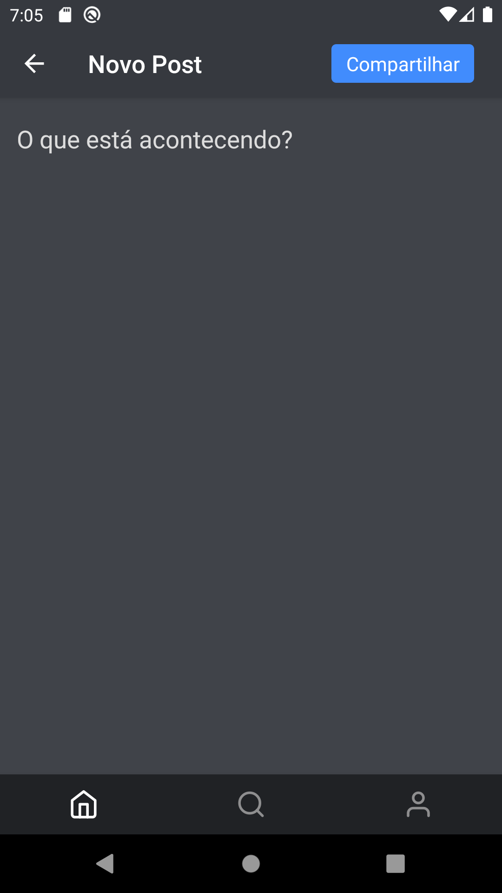
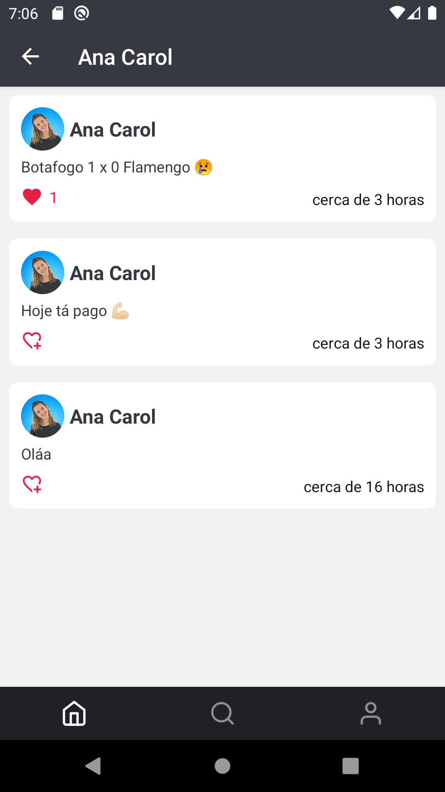

# DevPost


Uma rede social simples desenvolvida em React Native durante o curso Fabrica de Aplicativos. No aplicativo os usuários podem: realizar postagens na rede, curtir outros posts, buscar outros usuários e alterar informações pessoais (exemplo: nome e foto do perfil). 

## Screenshots

<p align="center">
    
    
    
</p>

<p align="center">
    
    
    
</p>

## Tecnologias
- React Native (v0.68.2)
- Async-storage
- Firebase
- react-native-image-picker
- react-native-vector-icons
- Async-storage
- react-native-animatable
- styled-components
- E mais...

___

## Instalação

Clone o projeto e acesse a sua pasta: 

```sh
$ git clone https://github.com/thiagoemanoel98/DevPost.git
$ cd DevPost
```

Instale as dependências do projeto e inicie:

```sh
# Dependências
$ npm install

# Start Android
$ npx react-native run-android

# Start IOS
npx react-native run-ios
```

___

Made with :coffee: by Thiago Emanoel :v:
